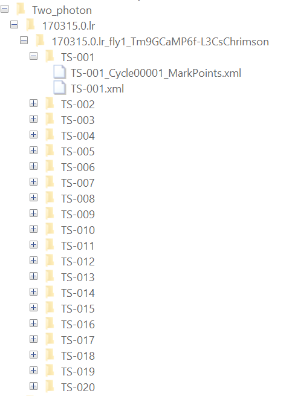
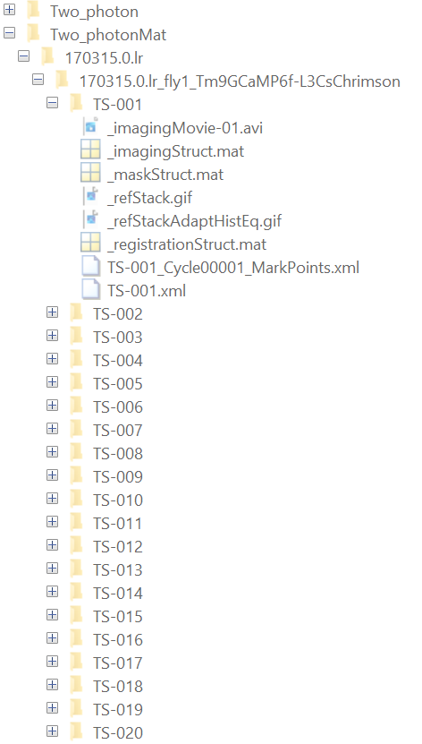
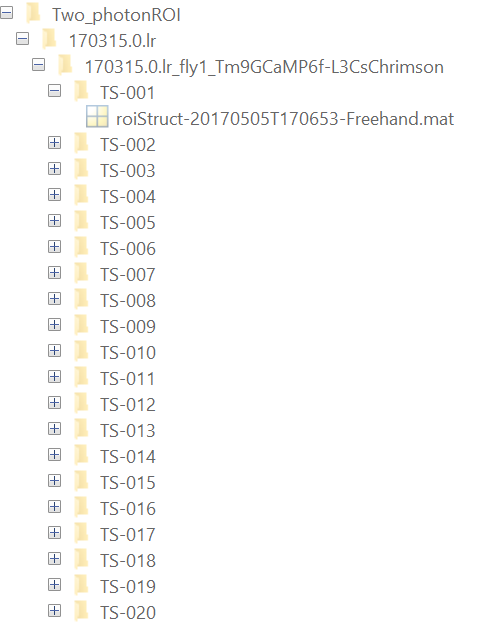

## Data Structure
- The analysis relies on organizing the data as follows:
	- Root Folder:
		- **Two_photon:** contains raw data and metadata files
		- **Two_photonMat:** contains preprocessed data
		- **Two_photonROI:** contains ROI mat files
	- Within each of the Two_photon folders there is a parallel organization.
		- **Day folders:** each recording day is contained in a folder such as `170315.0.lr` (date, experiment kind, experimenter initials)
		- **Fly folders:** each fly recording is contained in a folder such as `170315.0.lr_fly1_Tm9GCaMP6f-L3CsChrimson`
		- **Time series folders:** each time series recording (one layer of the fly lobula in different Z-planes), such as TS-001
- For replotting an intermediate file is provided `170928_lr_L3_C3_Tm1_OptogeneticsWoNaNsWoBGSubstraction.mat`
- 
- 
- 
- ## Code organization
- The file to parse and organize the data from Two_photonMat is `PlotOptogeneticsSummary_L3C3Tm1.m`
- Set `saveFolder` to root folder where data is located and output will be saved.
- Parameter `collectTimeSeries` is set to False, as we provide the end result of that operation in `170928_lr_L3_C3_Tm1_OptogeneticsWoNaNsWoBGSubstraction.mat`
- Running the script `PlotOptogeneticsSummary_L3C3Tm1.m` will generate a PDF with the Figure 2e, and a csv file with columns ROI, Genotype, Time and Response to be used for replotting in Python or other software.
- 